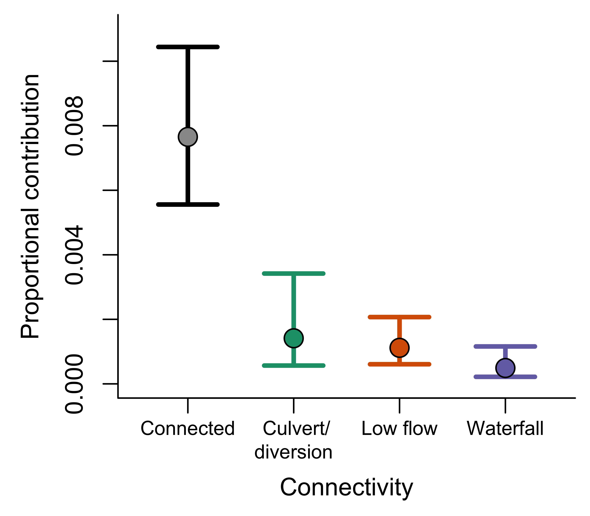
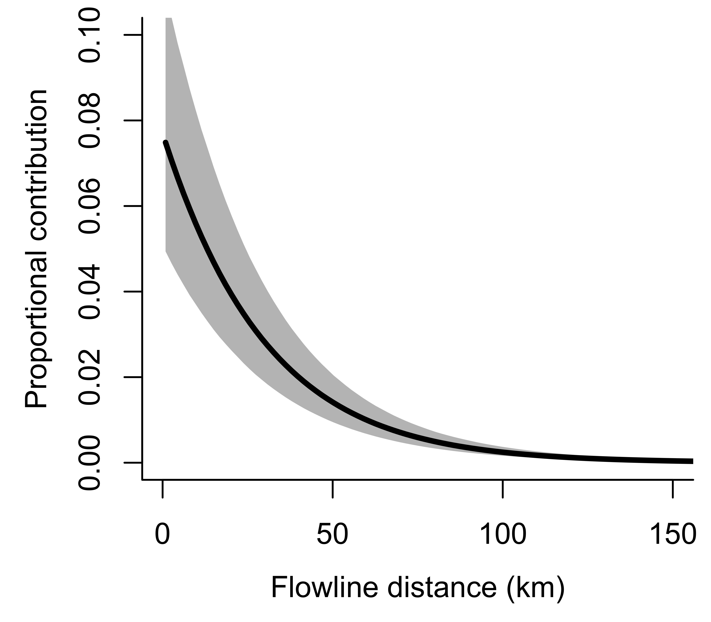
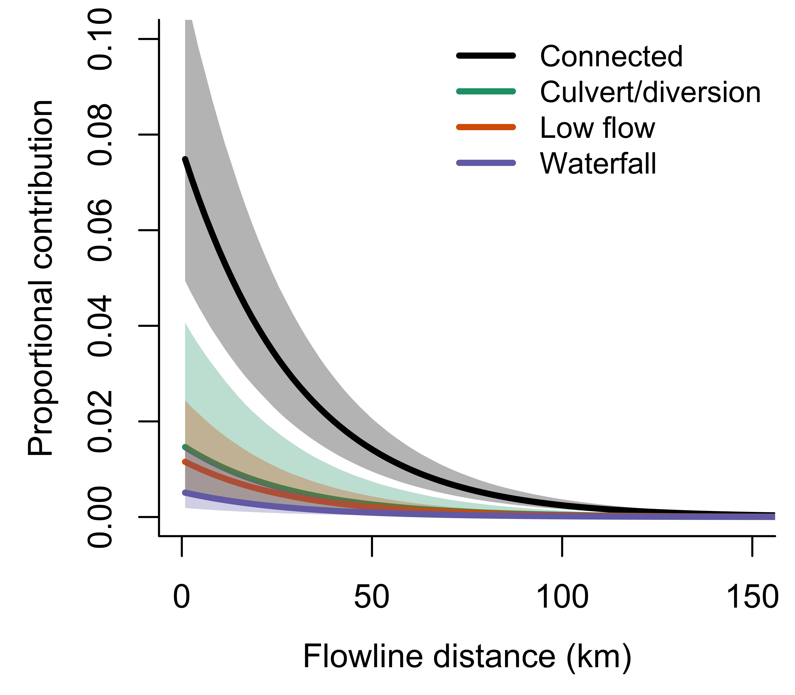
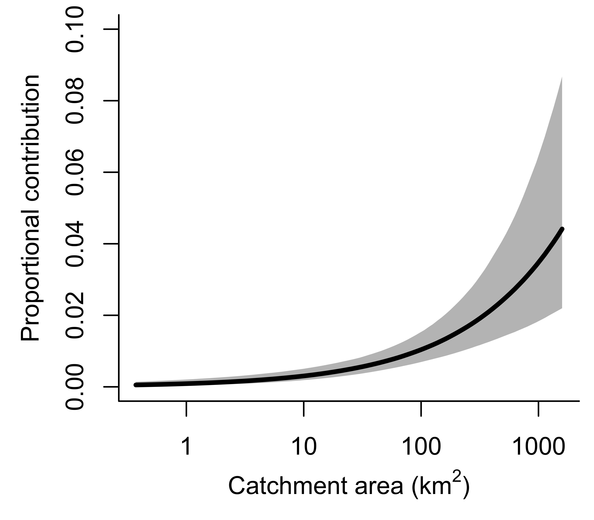
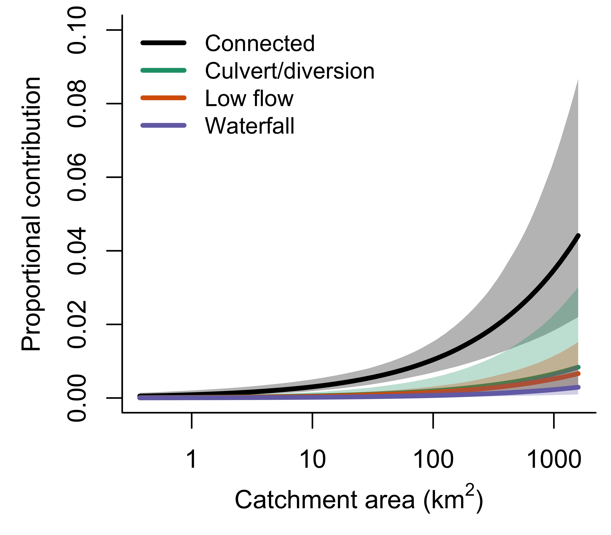
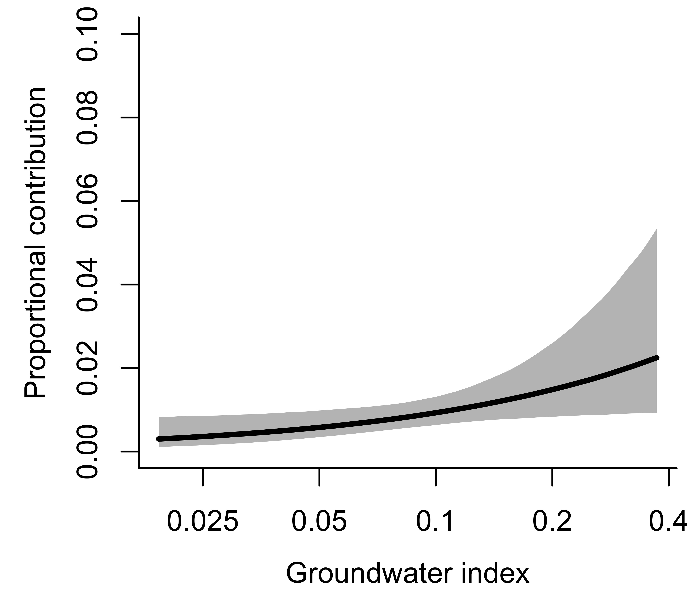
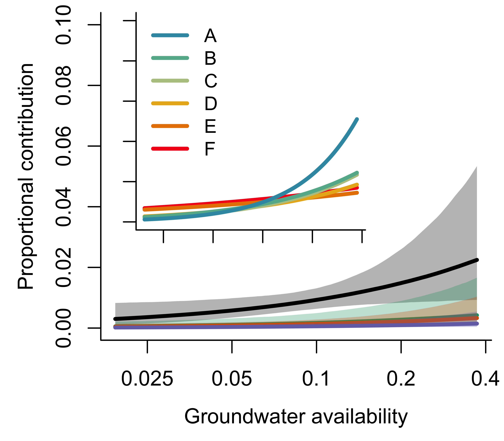
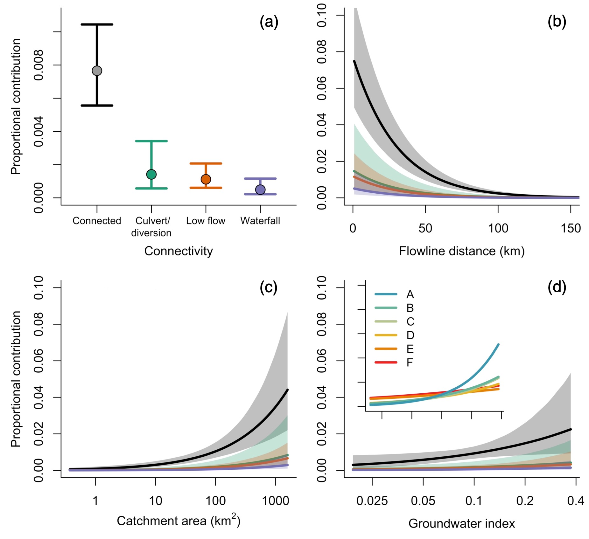

Purpose: quantify the effects of distance, catchment area, groundwater index, and connectivity on the proportional contribution of tributaries streams to the mainstem Snake River population of Yellowstone cutthroat trout.

```{r echo=FALSE, include=FALSE}
library(tidyverse)
library(scales)
library(GGally)
library(ggmcmc)
library(brms)
library(bayesplot)
library(ggpubr)
library(tidybayes)
library(HDInterval)
library(RColorBrewer)
library(terra)
library(mapview)
library(tidyterra)
```

## Data

### Mixing proportions

Load GSI/rubias output: bootstrapped mixing proportional contribution of reporting groups (tributaries) to the mainstem Snake River.
```{r}
gsi_dat <- readRDS("/Users/jeffbaldock/Library/CloudStorage/GoogleDrive-jbaldock@uwyo.edu/Shared drives/wyo-coop-baldock/UWyoming/Snake River Cutthroat/Analyses/Snake River GSI Quarto/GSI Analysis/By Section and Year/UpperSnake_GSI_SectionYear_output.RDS")
```


### Covariate data

Groundwater, distance, basin size, and connnectivity
```{r}
# groundwater metrics
gwmet <- read_csv("/Users/jeffbaldock/Library/CloudStorage/GoogleDrive-jbaldock@uwyo.edu/Shared drives/wyo-coop-baldock/UWyoming/Snake River Cutthroat/Analyses/Snake River GSI Quarto/Landscape Covariates/Groundwater/GroundwaterMetrics_raw_RepUnits.csv") %>% 
  rename(repunit = site) %>% 
  mutate(logarea = log(areasqkm), loggwi = log(gwi_iew05km)) %>% 
  mutate(z_logarea = as.numeric(scale(logarea)), z_loggwi = as.numeric(scale(loggwi))) %>%
  arrange(repunit)
# gwmet$repunit <- str_replace_all(gwmet$repunit, "deadman _greys", "deadman_greys")

# flowline distances
dist <- read_csv("/Users/jeffbaldock/Library/CloudStorage/GoogleDrive-jbaldock@uwyo.edu/Shared drives/wyo-coop-baldock/UWyoming/Snake River Cutthroat/Analyses/Snake River GSI Quarto/Landscape Covariates/Flowline Distance/SnakeRiverSections_RepUnits_FlowlineDistance.csv") %>%
  mutate(z_dist = as.numeric(scale(distkm)))

# barriers
barr <- read_csv("/Users/jeffbaldock/Library/CloudStorage/GoogleDrive-jbaldock@uwyo.edu/Shared drives/wyo-coop-baldock/UWyoming/Snake River Cutthroat/Analyses/Snake River GSI Quarto/Landscape Covariates/Barriers/RepUnits_BarrierSummary.csv") %>%
  mutate(log_barrier_dens = log(barrier_dens + 0.0001),
         z_barrier_dens = as.numeric(scale(barrier_dens)),
         z_barrier_num = as.numeric(scale(numbarr)),
         z_log_barrier_dens = as.numeric(scale(log_barrier_dens)),
         connect_type = as.factor(ifelse(is.na(connect_type), "connected", connect_type))) %>%
  mutate(connect_type = recode(connect_type, "culvert" = "culvert_diversion", "diversion dam" = "culvert_diversion"))

# Landcover
land <- read_csv("/Users/jeffbaldock/Library/CloudStorage/GoogleDrive-jbaldock@uwyo.edu/Shared drives/wyo-coop-baldock/UWyoming/Snake River Cutthroat/Analyses/Snake River GSI Quarto/Landscape Covariates/Landcover/RepUnits_LandcoverSummary.csv") %>%
  mutate(log_prop_ag = log(prop_ag + 0.0001),
         log_prop_dev = log(prop_dev + 0.0001),
         log_prop_agdev = log(prop_agdev + 0.0001),
         z_prop_ag = as.numeric(scale(prop_ag)),
         z_prop_dev = as.numeric(scale(prop_dev)),
         z_prop_agdev = as.numeric(scale(prop_agdev)),
         z_log_prop_ag = as.numeric(scale(log_prop_ag)),
         z_log_prop_dev = as.numeric(scale(log_prop_dev)),
         z_log_prop_agdev = as.numeric(scale(log_prop_agdev)))
```

Create tibble of means and SDs
```{r}
scltib <- tibble(param = c("logarea", "loggwi", "dist", "barrier_dens", "prop_ag", "prop_dev", "prop_agdev"), 
                 mean = c(attributes(scale(gwmet$logarea))$`scaled:center`, attributes(scale(gwmet$loggwi))$`scaled:center`, attributes(scale(dist$distkm))$`scaled:center`, attributes(scale(barr$barrier_dens))$`scaled:center`, attributes(scale(land$prop_ag))$`scaled:center`, attributes(scale(land$prop_dev))$`scaled:center`, attributes(scale(land$prop_agdev))$`scaled:center`),  
                 sd = c(attributes(scale(gwmet$logarea))$`scaled:scale`, attributes(scale(gwmet$loggwi))$`scaled:scale`, attributes(scale(dist$distkm))$`scaled:scale`, attributes(scale(barr$barrier_dens))$`scaled:scale`, attributes(scale(land$prop_ag))$`scaled:scale`, attributes(scale(land$prop_dev))$`scaled:scale`, attributes(scale(land$prop_agdev))$`scaled:scale`))
write_csv(scltib, "/Users/jeffbaldock/Library/CloudStorage/GoogleDrive-jbaldock@uwyo.edu/Shared drives/wyo-coop-baldock/UWyoming/Snake River Cutthroat/Analyses/Snake River GSI Quarto/Obj2 Model Contribution/GSI_Covariates_MeansStDevs.csv")
```


### Create long data
```{r}
data_long <- gsi_dat$bootstrapped_proportions %>%  
  left_join(gsi_dat$indiv_posteriors %>% group_by(indiv, mixture_collection) %>% summarize(n = n()) %>% group_by(mixture_collection) %>% summarize(sampsize = n())) %>% 
  mutate(bscorrnum = round(bs_corrected_repunit_ppn*sampsize, digits = 0),
         section = str_sub(mixture_collection, end = -6), 
         year = str_sub(mixture_collection, start = -4)) %>% 
  left_join(gwmet) %>% left_join(dist) %>% left_join(barr %>% select(repunit, barrier_dens, log_barrier_dens, connectivity, z_barrier_dens, z_log_barrier_dens, z_barrier_num, connect_type)) %>% left_join(land)
head(data_long)
```


## Visualize data

### Covariate collinearity

How correlated are the covariates?
```{r fig.width=8, fig.height=8}
ggpairs(data_long %>% select(z_dist, z_logarea, z_loggwi, connect_type))
```

### Contribution-covariate relationships

Plot proportional contribution against covariates
```{r fig.width=8, fig.height=7}
p1 <- data_long %>% ggplot(aes(x = z_dist, y = bs_corrected_repunit_ppn)) + geom_point() + geom_smooth()
p2 <- data_long %>% ggplot(aes(x = z_logarea, y = bs_corrected_repunit_ppn)) + geom_point() + geom_smooth()
p3 <- data_long %>% ggplot(aes(x = z_loggwi, y = bs_corrected_repunit_ppn)) + geom_point() + geom_smooth()
p4 <- data_long %>% ggplot(aes(x = connect_type, y = bs_corrected_repunit_ppn)) + geom_boxplot() + geom_smooth()

ggarrange(p1, p2, p3, p4, nrow = 2, ncol = 2)
```


### Connectivity sample size

How many streams and observations do we have for each type of connectivity? Coverage for types "culvert_diversion" and "waterfall" is low at the scale of individual streams. But replication across sections and years helps with that. 
```{r}
barr %>% group_by(connect_type) %>% summarize(n.streams = n()) %>% left_join(data_long %>% group_by(connect_type) %>% summarize(n.obs = n()))
```


## ZOIB

Fit a zero/one inflated beta regression model to estimate the effects of tributary/reporting group covariates on proportional contribution to the mainstem Snake River. Preliminary work tested multivariate model structures, such as Dirichlet and Dirichlet-multinomial (DM) models sensu Chong and Spencer (2018), Harrison *et al.* (2020), and Averill *et al.* (2021). DM models are well-suited for modeling compositional data as they account for covariance among group-level proportions due to the sum-to-1 constraint. However, covariate extensions of DM models treat each composition as a single observational unit and apply the covariate data to the composition as a whole, rather than to each of the component groups (reporting groups or tributaries), as is the goal of this study. Preliminary DM modelling indicated that violations to this covariate data structure led to highly overparameterized model fits. 

As recommended in Douma and Weedon (2019), we therefore use beta regression to quantify the effects of tributary covariates on proportional contribution. Beta regression is well-suited for modeling continuous proportions (as is the output of the rubias) and can be extended to account for excess zeros (zero inflation) and variance/precision heterogeneity (i.e., variable phi). While beta regression is designed for analyzing proportional data stemming from just 2 categories, multivariate extensions (i.e., Dirichlet regression) are not appropriate for our purposes given the constraints mentioned above (covariates are applied to the entire composition rather than each group individually). As a result, beta regression does not ensure the sum-to-1 constraint, however, we believe a change in one category will not necessarily lead to a change in all other categories due to the sheer number of categories in our study (i.e., reporting groups, n = 52). Furthermore, we are not specifically interested in making accurate predictions, but rather characterizing general patterns, and therefore believe the constraints of multivariate/compositional data can be relaxed. One could use a random effects structure to account for grouping of data into sections/years. But random intercepts do not make sense for proportional data (e.g., variation in section-specific mean contribution - randome intercept - would be driven by among-group heterogeneity in intercepts, not greater contribution across all groups within that section, because the proportions sum to 1). And random slopes add excess complexity to the model that we cannot justify. Preliminary models fit with both random slopes and intercepts had difficulty converging. 


### Fit model

Fit model using brms
```{r message=FALSE, warning=FALSE, eval=FALSE}
data_long <- data_long %>% mutate(repunit = as.factor(repunit), section = as.factor(section), year = as.factor(year))

# full model
mod_zoib1 <- brm(brmsformula(
  bs_corrected_repunit_ppn ~ (1 + z_loggwi | section) + (1|repunit)  + z_dist + z_logarea + z_loggwi + connect_type, 
  phi ~ z_dist + z_logarea + z_loggwi + connect_type, 
  zi ~ z_dist + z_logarea + z_loggwi + connect_type, 
  family = zero_inflated_beta()), data = data_long, iter = 4000)

# model with no zero inflation or variable phi...how much variation do just the covariates explain?
# mod_zoib0 <- brm(brmsformula(
#   bs_corrected_repunit_ppn ~ z_dist + z_logarea + z_loggwi + connect_type, 
#   phi ~ 1, 
#   zi ~ 1, 
#   family = zero_inflated_beta()), data = data_long, iter = 4000)

# write model objects to file 
saveRDS(mod_zoib1, "/Users/jeffbaldock/Library/CloudStorage/GoogleDrive-jbaldock@uwyo.edu/Shared drives/wyo-coop-baldock/UWyoming/Snake River Cutthroat/Analyses/Snake River GSI Quarto/Obj2 Model Contribution/brms_fit_zoib_fullmodel.rds")
# saveRDS(mod_zoib0, "/Users/jeffbaldock/Library/CloudStorage/GoogleDrive-jbaldock@uwyo.edu/Shared drives/wyo-coop-baldock/UWyoming/Snake River Cutthroat/Analyses/Snake River GSI Quarto/Obj 2 Model Contribution/bbrms_fit_zoib_fixefonly.rds")
```

Load fitted model object (to reduce rendering time)
```{r}
mod_zoib1 <- readRDS("/Users/jeffbaldock/Library/CloudStorage/GoogleDrive-jbaldock@uwyo.edu/Shared drives/wyo-coop-baldock/UWyoming/Snake River Cutthroat/Analyses/Snake River GSI Quarto/Obj2 Model Contribution/brms_fit_zoib_fullmodel.rds")
```


View model summary
```{r}
summary(mod_zoib1)
```

Bayesian R-squared
```{r}
# full model
myr2 <- bayes_R2(mod_zoib1, summary = FALSE)
myr2hdi <- HDInterval::hdi(myr2, credMass = 0.95)
hist(myr2, xlab = "Bayesian R-squared", xlim = c(0,1), main = "Full model", breaks = 20)
abline(v = median(myr2), lwd = 3, col = "darkred")
abline(v = unlist(myr2hdi), lwd = 1, lty = 2, col = "darkred")
legend("topleft", legend = c(paste("median = ", round(median(myr2), digits = 3), sep = ""), 
                              paste("95% HDI = ", round(myr2hdi[1], digits = 3), " - ", round(myr2hdi[2], digits = 3), sep = "")), 
       lty = c(1,2), lwd = c(3,1), col = "darkred", bty = "n")

# full model
# myr2 <- bayes_R2(mod_zoib0, summary = FALSE)
# myr2hdi <- HDInterval::hdi(myr2, credMass = 0.95)
# hist(myr2, xlab = "Bayesian R-squared", xlim = c(0,1), main = "No zero-inflation, no variable phi")
# abline(v = median(myr2), lwd = 3, col = "darkred")
# abline(v = unlist(myr2hdi), lwd = 1, lty = 2, col = "darkred")
# legend("topright", legend = c(paste("median = ", round(median(myr2), digits = 3), sep = ""), 
#                               paste("95% HDI = ", round(myr2hdi[1], digits = 3), " - ", round(myr2hdi[2], digits = 3), sep = "")), 
#        lty = c(1,2), lwd = c(3,1), col = "darkred", bty = "n")
```

### Convergence diagnostics

Any r-hat values >1.01?
```{r}
brms::rhat(mod_zoib1)[brms::rhat(mod_zoib1) >= 1.01]
```

Traceplots indicate model has converged
```{r fig.width=7, fig.height=7}
plot(mod_zoib1, variable = "^b_", ask = FALSE, regex = TRUE)
```

LOO-CV indicates the model is well-specified given the data (with the exception of 1 outlier)
```{r}
myloo <- loo(mod_zoib1)
myloo
plot(myloo, label_points = TRUE)
```

### PP-checks

Generate posterior predicted proportions and calculate median across iterations
```{r}
yrep <- brms::posterior_predict(mod_zoib1, ndraws = 8000)
yrep_sum <- apply(yrep, 2, median)
dim(yrep)
```

Bayesian p-value (closer to 0.5 is better). Suggests slightly biased model predictions
```{r}
length(which(yrep_sum > data_long$bs_corrected_repunit_ppn)) / length(data_long$bs_corrected_repunit_ppn)
```

How well can we replicate the observed data? Generally, poor. This because the covariates explain a relatively small proportion of the variance in proportional contribution. The strong effects of covariates on precision provide additional evidence for proportional contributions being hard to predict with just the covariates used in this model.
```{r}
pp_check(mod_zoib1, type = "scatter_avg") + coord_flip()
```

Can we replicate the distribution of the observed data? (Yes)
```{r}
pp_check(mod_zoib1, type = "hist", ndraws = 10)
```

What is the distribution of residuals relative to 0? Are residuals biased in either direction? (No)
```{r}
pp_check(mod_zoib1, type = "error_hist", ndraws = 10) + geom_vline(xintercept = 0, linetype = "dashed") #+ xlim(-0.2, 0.2)
```

How well can we replicate other features of the observed data? Proportion of zeros? (Looks good)
```{r}
prop_zero <- function(x) mean(x == 0)
ppc_stat(y = data_long$bs_corrected_repunit_ppn, yrep = yrep, stat = "prop_zero")
```

Mean? (Somewhat under-predicts the mean of the data)
```{r}
ppc_stat(y = data_long$bs_corrected_repunit_ppn, yrep = yrep, stat = "mean")
```


## Plot model output

Inverse logit function
```{r}
invlogit <- function(x) { exp(x) / (1 + exp(x)) }
```

List model variables
```{r}
get_variables(mod_zoib1)
```

### Primary effects

#### Generic plots

Model output indicates a negative effect of tributary-mainstem distance and positive effects of tributary catchment size and groundwater on proportional contribution of tributaries to the mainstem Snake River. Additionally, connected tributaries contribute considerably more than tributaries with disrupted connectivity.
```{r}
plot(conditional_effects(mod_zoib1), ask = FALSE, rug = TRUE)
```

View posterior distributions for continuous covariates to compare relative effect sizes: effect of distance is strongest, followed by area and finally groundwater.
```{r}
mod_zoib1 %>%
  spread_draws(b_z_dist, b_z_logarea, b_z_loggwi) %>%
  gather(b_z_dist:b_z_loggwi, key = "param", value = "estimate") %>%
  mutate(param = factor(recode(param, "b_z_dist" = "Distance", "b_z_logarea" = "Area", "b_z_loggwi" = "Groundwater"), levels = c("Groundwater", "Area", "Distance"))) %>% 
  ggplot(aes(y = param, x = estimate)) +
  stat_halfeye() + 
  geom_vline(xintercept = 0, linetype = "dashed") + #xlim(-0.3,1.5) +
  xlab("Posterion estimate") + ylab("Parameter") + theme_bw()
```

Section-specific effects of groundwater on proportional contribution: effect of groundwater is much stronger in upstream sections, exceeding the magnitude of the area effect in section A. 
```{r}
mod_zoib1 %>%
  spread_draws(b_z_loggwi, r_section[section,z_loggwi]) %>%
  filter(z_loggwi == "z_loggwi") %>% 
  mutate(section_mean_loggwi = b_z_loggwi + r_section,
         section = factor(recode(section, 
                            "snake_pacificdeadmans" = "A",
                            "snake_deadmansmoose" = "B",
                            "snake_moosewilson" = "C",
                            "snake_wilsonsouthpark" = "D",
                            "snake_southparkastoria" = "E",
                            "snake_astoriawesttable" = "F"), levels = c("F", "E", "D", "C", "B", "A"))) %>%
  ggplot(aes(y = section, x = section_mean_loggwi)) +
  stat_halfeye() + 
  geom_vline(xintercept = 0, linetype = "dashed") + xlim(-0.3,1.5) +
  xlab("Section-specific effect of groundwater on proportional contribution") + ylab("Mainstem Snake River section") + theme_bw()
```


#### Pretty plots

##### Connectivity
```{r}
mydraws <- mod_zoib1 %>% 
  spread_draws(b_Intercept, b_connect_typeculvert_diversion, b_connect_typelowflow, b_connect_typewaterfall) %>%
  mutate(beta_connected = invlogit(b_Intercept),
         beta_culvdiv = invlogit(b_Intercept + b_connect_typeculvert_diversion),
         beta_lowflow = invlogit(b_Intercept + b_connect_typelowflow),
         beta_waterfall = invlogit(b_Intercept + b_connect_typewaterfall)) %>%
  select(-c(b_Intercept, b_connect_typeculvert_diversion, b_connect_typelowflow, b_connect_typewaterfall)) %>%
  summarise_draws()
```

```{r echo=FALSE, message=FALSE, results='hide'}
jpeg("/Users/jeffbaldock/Library/CloudStorage/GoogleDrive-jbaldock@uwyo.edu/Shared drives/wyo-coop-baldock/UWyoming/Snake River Cutthroat/Analyses/Snake River GSI Quarto/Obj2 Model Contribution/MargEffects_Connectivity.jpg", units = "in", width = 4, height = 3.5, res = 1000)

# set up
par(mar = c(4,4,0.5,0.5), mgp = c(2.5,1.25,0))
mycols <- c("black", brewer.pal(3, "Dark2"))
uplim <- 0.1
npreds <- 100

# plot
plot(c(1:4) ~ c(1:4), ylim = c(0,0.011), xlim = c(0.5,4.5), type = "n", pch = NA, bty = "l", xlab = "Connectivity", ylab = "Proportional contribution", axes = FALSE)
axis(1, at = c(1:4), cex.axis = 0.8, labels = c("Connected\n ", " Culvert/\ndiversion", "Low flow\n ", "Waterfall\n "))
par(mgp = c(2.5,1,0))
axis(2)
box(bty = "l")
arrows(x0 = c(1:4), x1 = c(1:4), y0 = mydraws$median, y1 = mydraws$q95, angle = 90, col = mycols, lwd = 3, length = 0.2)
arrows(x0 = c(1:4), x1 = c(1:4), y0 = mydraws$median, y1 = mydraws$q5, angle = 90, col = mycols, lwd = 3, length = 0.2)
points(mydraws$median ~ c(1:4), pch = 21, bg = c("grey60", brewer.pal(3, "Dark2")), cex = 1.7)

dev.off()
```


##### Distance

Connected only
```{r echo=FALSE, message=FALSE, results='hide'}
jpeg("/Users/jeffbaldock/Library/CloudStorage/GoogleDrive-jbaldock@uwyo.edu/Shared drives/wyo-coop-baldock/UWyoming/Snake River Cutthroat/Analyses/Snake River GSI Quarto/Obj2 Model Contribution/MargEffects_Distance_ConnectedOnly.jpg", units = "in", width = 4, height = 3.5, res = 1000)

# set up
par(mar = c(4,4,0.5,0.5), mgp = c(2.5,1,0))
mycols <- c("black", brewer.pal(3, "Dark2"))
uplim <- 0.1
npreds <- 100

# draws
mydraws <- mod_zoib1 %>% spread_draws(b_Intercept, b_z_dist, b_connect_typeculvert_diversion, b_connect_typelowflow, b_connect_typewaterfall)

# x values for prediction
myx <- seq(from = min(data_long$z_dist), to = max(data_long$z_dist), length.out = npreds)
x.axis <- seq(from = 0, to = 150, by = 50)
x.scaled <- (x.axis - scltib$mean[scltib$param == "dist"]) / scltib$sd[scltib$param == "dist"]
x.lim <- (c(0,150) - scltib$mean[scltib$param == "dist"]) / scltib$sd[scltib$param == "dist"]

# set up plot
plot(seq(from = 0, to = uplim, length.out = npreds) ~ myx, xlim = x.lim, ylim = c(0,uplim), type = "n", pch = NA, bty = "l", xlab = "Flowline distance (km)", ylab = "Proportional contribution", axes = F)
axis(1, at = x.scaled, labels = x.axis)
axis(2)
box(bty = "l")

# Connected
pred_dist <- matrix(NA, nrow = nrow(mydraws), ncol = npreds)
for (i in 1:nrow(pred_dist)) { pred_dist[i,] <- invlogit(unlist(mydraws[i,"b_Intercept"]) + unlist(mydraws[i,"b_z_dist"])*myx) }
pred_lower <- apply(pred_dist, MARGIN = 2, quantile, prob = 0.025)
pred_upper <- apply(pred_dist, MARGIN = 2, quantile, prob = 0.975)
pred_median <- apply(pred_dist, MARGIN = 2, quantile, prob = 0.5)
polygon(c(myx, rev(myx)), c(pred_upper, rev(pred_lower)), col = scales::alpha(mycols[1], 0.3), lty = 0)
lines(pred_median ~ myx, lwd = 3, col = mycols[1])

dev.off()
```



All connect types
```{r echo=FALSE, message=FALSE, results='hide'}
jpeg("/Users/jeffbaldock/Library/CloudStorage/GoogleDrive-jbaldock@uwyo.edu/Shared drives/wyo-coop-baldock/UWyoming/Snake River Cutthroat/Analyses/Snake River GSI Quarto/Obj2 Model Contribution/MargEffects_Distance.jpg", units = "in", width = 4, height = 3.5, res = 1000)

# set up
par(mar = c(4,4,0.5,0.5), mgp = c(2.5,1,0))
mycols <- c("black", brewer.pal(3, "Dark2"))
uplim <- 0.1
npreds <- 100

# draws
mydraws <- mod_zoib1 %>% spread_draws(b_Intercept, b_z_dist, b_connect_typeculvert_diversion, b_connect_typelowflow, b_connect_typewaterfall)

# x values for prediction
myx <- seq(from = min(data_long$z_dist), to = max(data_long$z_dist), length.out = npreds)
x.axis <- seq(from = 0, to = 150, by = 50)
x.scaled <- (x.axis - scltib$mean[scltib$param == "dist"]) / scltib$sd[scltib$param == "dist"]
x.lim <- (c(0,150) - scltib$mean[scltib$param == "dist"]) / scltib$sd[scltib$param == "dist"]

# set up plot
plot(seq(from = 0, to = uplim, length.out = npreds) ~ myx, xlim = x.lim, ylim = c(0,uplim), type = "n", pch = NA, bty = "l", xlab = "Flowline distance (km)", ylab = "Proportional contribution", axes = F)
axis(1, at = x.scaled, labels = x.axis)
axis(2)
box(bty = "l")

# Connected
pred_dist <- matrix(NA, nrow = nrow(mydraws), ncol = npreds)
for (i in 1:nrow(pred_dist)) { pred_dist[i,] <- invlogit(unlist(mydraws[i,"b_Intercept"]) + unlist(mydraws[i,"b_z_dist"])*myx) }
pred_lower <- apply(pred_dist, MARGIN = 2, quantile, prob = 0.025)
pred_upper <- apply(pred_dist, MARGIN = 2, quantile, prob = 0.975)
pred_median <- apply(pred_dist, MARGIN = 2, quantile, prob = 0.5)
polygon(c(myx, rev(myx)), c(pred_upper, rev(pred_lower)), col = scales::alpha(mycols[1], 0.3), lty = 0)
lines(pred_median ~ myx, lwd = 3, col = mycols[1])

# Culvert/diversion
pred_dist <- matrix(NA, nrow = nrow(mydraws), ncol = npreds)
for (i in 1:nrow(pred_dist)) { pred_dist[i,] <- invlogit(unlist(mydraws[i,"b_Intercept"]) + unlist(mydraws[i,"b_z_dist"])*myx + unlist(mydraws[i,"b_connect_typeculvert_diversion"])) }
pred_lower <- apply(pred_dist, MARGIN = 2, quantile, prob = 0.025)
pred_upper <- apply(pred_dist, MARGIN = 2, quantile, prob = 0.975)
pred_median <- apply(pred_dist, MARGIN = 2, quantile, prob = 0.5)
polygon(c(myx, rev(myx)), c(pred_upper, rev(pred_lower)), col = scales::alpha(mycols[2], 0.3), lty = 0)
lines(pred_median ~ myx, lwd = 3, col = mycols[2])

# Low flow
pred_dist <- matrix(NA, nrow = nrow(mydraws), ncol = npreds)
for (i in 1:nrow(pred_dist)) { pred_dist[i,] <- invlogit(unlist(mydraws[i,"b_Intercept"]) + unlist(mydraws[i,"b_z_dist"])*myx + unlist(mydraws[i,"b_connect_typelowflow"])) }
pred_lower <- apply(pred_dist, MARGIN = 2, quantile, prob = 0.025)
pred_upper <- apply(pred_dist, MARGIN = 2, quantile, prob = 0.975)
pred_median <- apply(pred_dist, MARGIN = 2, quantile, prob = 0.5)
polygon(c(myx, rev(myx)), c(pred_upper, rev(pred_lower)), col = scales::alpha(mycols[3], 0.3), lty = 0)
lines(pred_median ~ myx, lwd = 3, col = mycols[3])

# waterfall
pred_dist <- matrix(NA, nrow = nrow(mydraws), ncol = npreds)
for (i in 1:nrow(pred_dist)) { pred_dist[i,] <- invlogit(unlist(mydraws[i,"b_Intercept"]) + unlist(mydraws[i,"b_z_dist"])*myx + unlist(mydraws[i,"b_connect_typewaterfall"])) }
pred_lower <- apply(pred_dist, MARGIN = 2, quantile, prob = 0.025)
pred_upper <- apply(pred_dist, MARGIN = 2, quantile, prob = 0.975)
pred_median <- apply(pred_dist, MARGIN = 2, quantile, prob = 0.5)
polygon(c(myx, rev(myx)), c(pred_upper, rev(pred_lower)), col = scales::alpha(mycols[4], 0.3), lty = 0)
lines(pred_median ~ myx, lwd = 3, col = mycols[4])

# legend
legend("topright", bty = "n", legend = c("Connected", "Culvert/diversion", "Low flow", "Waterfall"), lwd = 3, col = mycols, cex = 0.9)

dev.off()
```


##### Area

Connected only
```{r echo=FALSE, message=FALSE, results='hide'}
jpeg("/Users/jeffbaldock/Library/CloudStorage/GoogleDrive-jbaldock@uwyo.edu/Shared drives/wyo-coop-baldock/UWyoming/Snake River Cutthroat/Analyses/Snake River GSI Quarto/Obj2 Model Contribution/MargEffects_Area_ConnectedOnly.jpg", units = "in", width = 4, height = 3.5, res = 1000)

# set up
par(mar = c(4,4,0.5,0.5), mgp = c(2.5,1,0))
mycols <- c("black", brewer.pal(3, "Dark2"))
uplim <- 0.1
npreds <- 100

# draws
mydraws <- mod_zoib1 %>% spread_draws(b_Intercept, b_z_logarea, b_connect_typeculvert_diversion, b_connect_typelowflow, b_connect_typewaterfall)

# x values for prediction
myx <- seq(from = min(data_long$z_logarea), to = max(data_long$z_logarea), length.out = npreds)
x.axis <- c(1,10,100,1000)
x.scaled <- (log(x.axis) - scltib$mean[scltib$param == "logarea"]) / scltib$sd[scltib$param == "logarea"]
#x.lim <- (c(0,150) - scltib$mean[scltib$param == "logarea"]) / scltib$sd[scltib$param == "logarea"]

# set up plot
plot(seq(from = 0, to = uplim, length.out = npreds) ~ myx, ylim = c(0,uplim), type = "n", pch = NA, bty = "l", xlab = expression(paste("Catchment area (km"^"2", ")")), ylab = "Proportional contribution", axes = F)
axis(1, at = x.scaled, labels = x.axis)
axis(2)
box(bty = "l")

# Connected
pred_dist <- matrix(NA, nrow = nrow(mydraws), ncol = npreds)
for (i in 1:nrow(pred_dist)) { pred_dist[i,] <- invlogit(unlist(mydraws[i,"b_Intercept"]) + unlist(mydraws[i,"b_z_logarea"])*myx) }
pred_lower <- apply(pred_dist, MARGIN = 2, quantile, prob = 0.025)
pred_upper <- apply(pred_dist, MARGIN = 2, quantile, prob = 0.975)
pred_median <- apply(pred_dist, MARGIN = 2, quantile, prob = 0.5)
polygon(c(myx, rev(myx)), c(pred_upper, rev(pred_lower)), col = scales::alpha(mycols[1], 0.3), lty = 0)
lines(pred_median ~ myx, lwd = 3, col = mycols[1])

dev.off()
```


All connect types
```{r echo=FALSE, message=FALSE, results='hide'}
jpeg("/Users/jeffbaldock/Library/CloudStorage/GoogleDrive-jbaldock@uwyo.edu/Shared drives/wyo-coop-baldock/UWyoming/Snake River Cutthroat/Analyses/Snake River GSI Quarto/Obj2 Model Contribution/MargEffects_Area.jpg", units = "in", width = 4, height = 3.5, res = 1000)

# set up
par(mar = c(4,4,0.5,0.5), mgp = c(2.5,1,0))
mycols <- c("black", brewer.pal(3, "Dark2"))
uplim <- 0.1
npreds <- 100

# draws
mydraws <- mod_zoib1 %>% spread_draws(b_Intercept, b_z_logarea, b_connect_typeculvert_diversion, b_connect_typelowflow, b_connect_typewaterfall)

# x values for prediction
myx <- seq(from = min(data_long$z_logarea), to = max(data_long$z_logarea), length.out = npreds)
x.axis <- c(1,10,100,1000)
x.scaled <- (log(x.axis) - scltib$mean[scltib$param == "logarea"]) / scltib$sd[scltib$param == "logarea"]
#x.lim <- (c(0,150) - scltib$mean[scltib$param == "logarea"]) / scltib$sd[scltib$param == "logarea"]

# set up plot
plot(seq(from = 0, to = uplim, length.out = npreds) ~ myx, ylim = c(0,uplim), type = "n", pch = NA, bty = "l", xlab = expression(paste("Catchment area (km"^"2", ")")), ylab = "Proportional contribution", axes = F)
axis(1, at = x.scaled, labels = x.axis)
axis(2)
box(bty = "l")

# Connected
pred_dist <- matrix(NA, nrow = nrow(mydraws), ncol = npreds)
for (i in 1:nrow(pred_dist)) { pred_dist[i,] <- invlogit(unlist(mydraws[i,"b_Intercept"]) + unlist(mydraws[i,"b_z_logarea"])*myx) }
pred_lower <- apply(pred_dist, MARGIN = 2, quantile, prob = 0.025)
pred_upper <- apply(pred_dist, MARGIN = 2, quantile, prob = 0.975)
pred_median <- apply(pred_dist, MARGIN = 2, quantile, prob = 0.5)
polygon(c(myx, rev(myx)), c(pred_upper, rev(pred_lower)), col = scales::alpha(mycols[1], 0.3), lty = 0)
lines(pred_median ~ myx, lwd = 3, col = mycols[1])

# Culvert/diversion
pred_dist <- matrix(NA, nrow = nrow(mydraws), ncol = npreds)
for (i in 1:nrow(pred_dist)) { pred_dist[i,] <- invlogit(unlist(mydraws[i,"b_Intercept"]) + unlist(mydraws[i,"b_z_logarea"])*myx + unlist(mydraws[i,"b_connect_typeculvert_diversion"])) }
pred_lower <- apply(pred_dist, MARGIN = 2, quantile, prob = 0.025)
pred_upper <- apply(pred_dist, MARGIN = 2, quantile, prob = 0.975)
pred_median <- apply(pred_dist, MARGIN = 2, quantile, prob = 0.5)
polygon(c(myx, rev(myx)), c(pred_upper, rev(pred_lower)), col = scales::alpha(mycols[2], 0.3), lty = 0)
lines(pred_median ~ myx, lwd = 3, col = mycols[2])

# Low flow
pred_dist <- matrix(NA, nrow = nrow(mydraws), ncol = npreds)
for (i in 1:nrow(pred_dist)) { pred_dist[i,] <- invlogit(unlist(mydraws[i,"b_Intercept"]) + unlist(mydraws[i,"b_z_logarea"])*myx + unlist(mydraws[i,"b_connect_typelowflow"])) }
pred_lower <- apply(pred_dist, MARGIN = 2, quantile, prob = 0.025)
pred_upper <- apply(pred_dist, MARGIN = 2, quantile, prob = 0.975)
pred_median <- apply(pred_dist, MARGIN = 2, quantile, prob = 0.5)
polygon(c(myx, rev(myx)), c(pred_upper, rev(pred_lower)), col = scales::alpha(mycols[3], 0.3), lty = 0)
lines(pred_median ~ myx, lwd = 3, col = mycols[3])

# waterfall
pred_dist <- matrix(NA, nrow = nrow(mydraws), ncol = npreds)
for (i in 1:nrow(pred_dist)) { pred_dist[i,] <- invlogit(unlist(mydraws[i,"b_Intercept"]) + unlist(mydraws[i,"b_z_logarea"])*myx + unlist(mydraws[i,"b_connect_typewaterfall"])) }
pred_lower <- apply(pred_dist, MARGIN = 2, quantile, prob = 0.025)
pred_upper <- apply(pred_dist, MARGIN = 2, quantile, prob = 0.975)
pred_median <- apply(pred_dist, MARGIN = 2, quantile, prob = 0.5)
polygon(c(myx, rev(myx)), c(pred_upper, rev(pred_lower)), col = scales::alpha(mycols[4], 0.3), lty = 0)
lines(pred_median ~ myx, lwd = 3, col = mycols[4])

# legend
legend("topleft", bty = "n", legend = c("Connected", "Culvert/diversion", "Low flow", "Waterfall"), lwd = 3, col = mycols, cex = 0.9)

dev.off()
```



##### Groundwater

Connected only
```{r echo=FALSE, message=FALSE, results='hide'}
jpeg("/Users/jeffbaldock/Library/CloudStorage/GoogleDrive-jbaldock@uwyo.edu/Shared drives/wyo-coop-baldock/UWyoming/Snake River Cutthroat/Analyses/Snake River GSI Quarto/Obj2 Model Contribution/MargEffects_Groundwater_ConnectedOnly.jpg", units = "in", width = 4, height = 3.5, res = 1000)

# set up
par(mar = c(4,4,0.5,0.5), mgp = c(2.5,1,0))
mycols <- c("black", brewer.pal(3, "Dark2"))
uplim <- 0.1
npreds <- 100

# draws
mydraws <- mod_zoib1 %>% spread_draws(b_Intercept, b_z_loggwi, b_connect_typeculvert_diversion, b_connect_typelowflow, b_connect_typewaterfall)

# x values for prediction
myx <- seq(from = min(data_long$z_loggwi), to = max(data_long$z_loggwi), length.out = npreds)
x.axis <- c(0.025,0.05,0.1,0.2,0.4)
x.scaled <- (log(x.axis) - scltib$mean[scltib$param == "loggwi"]) / scltib$sd[scltib$param == "loggwi"]
#x.lim <- (c(0,150) - scltib$mean[scltib$param == "logarea"]) / scltib$sd[scltib$param == "logarea"]

# set up plot
plot(seq(from = 0, to = uplim, length.out = npreds) ~ myx, ylim = c(0,uplim), type = "n", pch = NA, bty = "l", xlab = "Groundwater index", ylab = "Proportional contribution", axes = F)
axis(1, at = x.scaled, labels = x.axis)
axis(2)
box(bty = "l")

# Connected
pred_dist <- matrix(NA, nrow = nrow(mydraws), ncol = npreds)
for (i in 1:nrow(pred_dist)) { pred_dist[i,] <- invlogit(unlist(mydraws[i,"b_Intercept"]) + unlist(mydraws[i,"b_z_loggwi"])*myx) }
pred_lower <- apply(pred_dist, MARGIN = 2, quantile, prob = 0.025)
pred_upper <- apply(pred_dist, MARGIN = 2, quantile, prob = 0.975)
pred_median <- apply(pred_dist, MARGIN = 2, quantile, prob = 0.5)
polygon(c(myx, rev(myx)), c(pred_upper, rev(pred_lower)), col = scales::alpha(mycols[1], 0.3), lty = 0)
lines(pred_median ~ myx, lwd = 3, col = mycols[1])

dev.off()
```



All connect types
```{r echo=FALSE, message=FALSE, results='hide'}
jpeg("/Users/jeffbaldock/Library/CloudStorage/GoogleDrive-jbaldock@uwyo.edu/Shared drives/wyo-coop-baldock/UWyoming/Snake River Cutthroat/Analyses/Snake River GSI Quarto/Obj2 Model Contribution/MargEffects_Groundwater_wSubplot.jpg", units = "in", width = 4, height = 3.5, res = 1000)

# set up
par(mar = c(4,4,0.5,0.5), mgp = c(2.5,1,0))
mycols <- c("black", brewer.pal(3, "Dark2"))
uplim <- 0.1
npreds <- 100

# draws
mydraws <- mod_zoib1 %>% spread_draws(b_Intercept, b_z_loggwi, b_connect_typeculvert_diversion, b_connect_typelowflow, b_connect_typewaterfall)

# x values for prediction
myx <- seq(from = min(data_long$z_loggwi), to = max(data_long$z_loggwi), length.out = npreds)
x.axis <- c(0.025,0.05,0.1,0.2,0.4)
x.scaled <- (log(x.axis) - scltib$mean[scltib$param == "loggwi"]) / scltib$sd[scltib$param == "loggwi"]
#x.lim <- (c(0,150) - scltib$mean[scltib$param == "logarea"]) / scltib$sd[scltib$param == "logarea"]

# set up plot
plot(seq(from = 0, to = uplim, length.out = npreds) ~ myx, ylim = c(0,uplim), type = "n", pch = NA, bty = "l", xlab = "Groundwater availability", ylab = "Proportional contribution", axes = F)
axis(1, at = x.scaled, labels = x.axis)
axis(2)
box(bty = "l")

# Connected
pred_dist <- matrix(NA, nrow = nrow(mydraws), ncol = npreds)
for (i in 1:nrow(pred_dist)) { pred_dist[i,] <- invlogit(unlist(mydraws[i,"b_Intercept"]) + unlist(mydraws[i,"b_z_loggwi"])*myx) }
pred_lower <- apply(pred_dist, MARGIN = 2, quantile, prob = 0.025)
pred_upper <- apply(pred_dist, MARGIN = 2, quantile, prob = 0.975)
pred_median <- apply(pred_dist, MARGIN = 2, quantile, prob = 0.5)
polygon(c(myx, rev(myx)), c(pred_upper, rev(pred_lower)), col = scales::alpha(mycols[1], 0.3), lty = 0)
lines(pred_median ~ myx, lwd = 3, col = mycols[1])

# Culvert/diversion
pred_dist <- matrix(NA, nrow = nrow(mydraws), ncol = npreds)
for (i in 1:nrow(pred_dist)) { pred_dist[i,] <- invlogit(unlist(mydraws[i,"b_Intercept"]) + unlist(mydraws[i,"b_z_loggwi"])*myx + unlist(mydraws[i,"b_connect_typeculvert_diversion"])) }
pred_lower <- apply(pred_dist, MARGIN = 2, quantile, prob = 0.025)
pred_upper <- apply(pred_dist, MARGIN = 2, quantile, prob = 0.975)
pred_median <- apply(pred_dist, MARGIN = 2, quantile, prob = 0.5)
polygon(c(myx, rev(myx)), c(pred_upper, rev(pred_lower)), col = scales::alpha(mycols[2], 0.3), lty = 0)
lines(pred_median ~ myx, lwd = 3, col = mycols[2])

# Low flow
pred_dist <- matrix(NA, nrow = nrow(mydraws), ncol = npreds)
for (i in 1:nrow(pred_dist)) { pred_dist[i,] <- invlogit(unlist(mydraws[i,"b_Intercept"]) + unlist(mydraws[i,"b_z_loggwi"])*myx + unlist(mydraws[i,"b_connect_typelowflow"])) }
pred_lower <- apply(pred_dist, MARGIN = 2, quantile, prob = 0.025)
pred_upper <- apply(pred_dist, MARGIN = 2, quantile, prob = 0.975)
pred_median <- apply(pred_dist, MARGIN = 2, quantile, prob = 0.5)
polygon(c(myx, rev(myx)), c(pred_upper, rev(pred_lower)), col = scales::alpha(mycols[3], 0.3), lty = 0)
lines(pred_median ~ myx, lwd = 3, col = mycols[3])

# waterfall
pred_dist <- matrix(NA, nrow = nrow(mydraws), ncol = npreds)
for (i in 1:nrow(pred_dist)) { pred_dist[i,] <- invlogit(unlist(mydraws[i,"b_Intercept"]) + unlist(mydraws[i,"b_z_loggwi"])*myx + unlist(mydraws[i,"b_connect_typewaterfall"])) }
pred_lower <- apply(pred_dist, MARGIN = 2, quantile, prob = 0.025)
pred_upper <- apply(pred_dist, MARGIN = 2, quantile, prob = 0.975)
pred_median <- apply(pred_dist, MARGIN = 2, quantile, prob = 0.5)
polygon(c(myx, rev(myx)), c(pred_upper, rev(pred_lower)), col = scales::alpha(mycols[4], 0.3), lty = 0)
lines(pred_median ~ myx, lwd = 3, col = mycols[4])

# legend
#legend("topleft", bty = "n", legend = c("Connected", "Culvert/diversion", "Low flow", "Waterfall"), lwd = 3, col = mycols, cex = 0.9)

# add section subplot
par(fig = c(0.07,0.75, 0.25, 1), new = T, mar = c(4,4,0.5,0.5), mgp = c(2.5,0.5,0), cex.axis = 0.8)
mycols <- hcl.colors(6, "Zissou 1")

# draws
mydraws <- mod_zoib1 %>%
  spread_draws(b_Intercept, b_z_loggwi, r_section[section,z_loggwi]) %>%
  spread(key = z_loggwi, value = r_section) %>%
  mutate(beta_random = b_z_loggwi + z_loggwi,
         int_random = b_Intercept + Intercept,
         section2 = factor(recode(section, 
                            "snake_pacificdeadmans" = "A",
                            "snake_deadmansmoose" = "B",
                            "snake_moosewilson" = "C",
                            "snake_wilsonsouthpark" = "D",
                            "snake_southparkastoria" = "E",
                            "snake_astoriawesttable" = "F"), levels = c("F", "E", "D", "C", "B", "A"))) 
nsims <- nrow(mydraws) / 6

# x values for prediction
myx <- seq(from = min(data_long$z_loggwi), to = max(data_long$z_loggwi), length.out = npreds)
x.axis <- c(0.025,0.05,0.1,0.2,0.4)
x.scaled <- (log(x.axis) - scltib$mean[scltib$param == "loggwi"]) / scltib$sd[scltib$param == "loggwi"]

# set up plot
plot(seq(from = 0, to = uplim, length.out = npreds) ~ myx, ylim = c(0,uplim), type = "n", pch = NA, bty = "l", xlab = "", ylab = "", axes = F)
axis(1, at = x.scaled, labels = NA)
axis(2, labels = NA)
box(bty = "l")

sect <- c("F","E","D","C","B","A")
for (j in 1:length(sect)) {
  mydraws_sub <- mydraws %>% filter(section2 == sect[j])
  pred_dist <- matrix(NA, nrow = nsims, ncol = npreds)
  for (i in 1:nsims) { pred_dist[i,] <- invlogit(unlist(mydraws_sub[i,"int_random"]) + unlist(mydraws_sub[i,"beta_random"])*myx) }
  pred_median <- apply(pred_dist, MARGIN = 2, quantile, prob = 0.5)
  lines(pred_median ~ myx, lwd = 3, col = rev(mycols)[j])
}
legend("topleft", bty = "n", legend = c("A", "B", "C", "D", "E", "F"), lwd = 3, col = mycols, cex = 0.9)


dev.off()
```





### Random effects

Random effect of reporting unit, offset to the global intercept. Random intercepts indicate reporting units that contribute more or less than expected, after account for the effects of distance, area, and groundwater (and zero-inflation and precision components of the model). 
```{r fig.width=6, fig.height=8}
p1 <- mod_zoib1 %>%
  spread_draws(r_repunit[repunit,]) %>%
  #compare_levels(r_repunit, by = repunit) %>%
  ungroup() %>%
  mutate(repunit = reorder(repunit, r_repunit)) %>%
  ggplot(aes(y = repunit, x = r_repunit)) +
  stat_pointinterval(.width = c(.80, .95)) +
  geom_vline(xintercept = 0, linetype = "dashed") +
  ylab("Reporting unit") + xlab("Offset to intercept")
print(p1)
```

```{r echo=FALSE, message=FALSE, results='hide'}
jpeg("/Users/jeffbaldock/Library/CloudStorage/GoogleDrive-jbaldock@uwyo.edu/Shared drives/wyo-coop-baldock/UWyoming/Snake River Cutthroat/Analyses/Snake River GSI Quarto/Obj2 Model Contribution/plots/RandomEffects_Repunit.jpg", units = "in", width = 6, height = 8, res = 1000)
print(p1)
dev.off()
```


```{r}
# flowline
flowline <- vect("/Users/jeffbaldock/Library/CloudStorage/GoogleDrive-jbaldock@uwyo.edu/Shared drives/wyo-coop-baldock/UWyoming/Snake River Cutthroat/Data/Spatial/Flowline/FlowlineEditing/SnakeHeadwaters_flowline_springsclean.shp")

# reporting unit locations
sites_repu <- vect("/Users/jeffbaldock/Library/CloudStorage/GoogleDrive-jbaldock@uwyo.edu/Shared drives/wyo-coop-baldock/UWyoming/Snake River Cutthroat/Analyses/Snake River GSI Quarto/Landscape Covariates/Location Data/RepUnit_SpatialLocations.shp")
sites_repu <- sort(sites_repu, "repunit")

# summarize reporting unit random effects
rpint_summ <- mod_zoib1 %>%
  spread_draws(r_repunit[repunit,]) %>%
  group_by(repunit) %>%
  median_qi(r_repunit) %>%
  ungroup() %>%
  mutate(repunit = reorder(repunit, r_repunit))
rpint_summ
sites_repu$repunit == rpint_summ$repunit
tibble(x = sites_repu$repunit, y = rpint_summ$repunit)

# add to vector
sites_repu$low <- rpint_summ$.lower[rpint_summ$repunit == sites_repu$repunit]
sites_repu$upp <- rpint_summ$.upper[rpint_summ$repunit == sites_repu$repunit]
sites_repu$med <- rpint_summ$r_repunit[rpint_summ$repunit == sites_repu$repunit]

# map it
mapview(flowline) + mapview(sites_repu, zcol = "med", col.regions = rev(hcl.colors(10, "Blue-Red")), alpha.regions = 1)
```


Random effect of section of the mainstem Snake River, offset to the global intercept. (These really don't have any functional meaning, because proportions within sections must add to 1, so no section can have a larger or smaller average contribution. I included random intercepts following inclusion of random slopes for groundwater across sections, and including random slopes but not intercepts is generally not recommended.)
```{r fig.height=3}
p1 <- mod_zoib1 %>%
  spread_draws(r_section[section,]) %>%
  ungroup() %>%
  mutate(section = reorder(section, r_section),
         section = factor(recode(section, 
                            "snake_pacificdeadmans" = "A",
                            "snake_deadmansmoose" = "B",
                            "snake_moosewilson" = "C",
                            "snake_wilsonsouthpark" = "D",
                            "snake_southparkastoria" = "E",
                            "snake_astoriawesttable" = "F"), levels = c("F", "E", "D", "C", "B", "A"))) %>%
  ggplot(aes(y = section, x = r_section)) +
  stat_pointinterval(.width = c(.80, .95)) +
  geom_vline(xintercept = 0, linetype = "dashed") +
  ylab("Section") + xlab("Offset to intercept")
print(p1)
```


### Zero-inflation

Plot zero-inflation effects: increasing distance increases the probability of observing 0 contribution, whereas increase catchment area and groundwater contribution decreases the probability of observing a 0. Further, probability of observing a 0 is greatest for tributaries in which connectivity is disrupted by a waterfall, intermediate for connected tributaries and those in which connectivity is disrupted by culverts/diversions, and lowest for tributaries in which connectivity is disrupted by low flow. 
```{r}
plot(conditional_effects(mod_zoib1, dpar = "zi"), ask = FALSE, rug = TRUE)
```

How different is the probability of observing 0 for disconnected tributaries as compared to connected tributaries? 95% credible intervals all overlap 0. For type = "waterfall", 90% CI does not overlap 0.
```{r}
mod_zoib1 %>%
  spread_draws(b_zi_Intercept, b_zi_connect_typeculvert_diversion, b_zi_connect_typelowflow, b_zi_connect_typewaterfall) %>%
  mutate(connected = invlogit(b_zi_Intercept),
         culvert_diversion = invlogit(b_zi_Intercept + b_zi_connect_typeculvert_diversion),
         lowflow = invlogit(b_zi_Intercept + b_zi_connect_typelowflow),
         waterfall = invlogit(b_zi_Intercept + b_zi_connect_typewaterfall)) %>%
  mutate(conn_culvert_diversion = culvert_diversion - connected,
         conn_lowflow = lowflow - connected,
         conn_waterfall = waterfall - connected) %>%
  gather(conn_culvert_diversion:conn_waterfall, key = "param", value = "estimate") %>%
  select(param, estimate) %>%
  group_by(param) %>%
  median_qi(.width = c(0.95, 0.9))

mod_zoib1 %>%
  spread_draws(b_zi_Intercept, b_zi_connect_typeculvert_diversion, b_zi_connect_typelowflow, b_zi_connect_typewaterfall) %>%
  mutate(connected = invlogit(b_zi_Intercept),
         culvert_diversion = invlogit(b_zi_Intercept + b_zi_connect_typeculvert_diversion),
         lowflow = invlogit(b_zi_Intercept + b_zi_connect_typelowflow),
         waterfall = invlogit(b_zi_Intercept + b_zi_connect_typewaterfall)) %>%
  mutate(conn_culvert_diversion = culvert_diversion - connected,
         conn_lowflow = lowflow - connected,
         conn_waterfall = waterfall - connected) %>%
  gather(conn_culvert_diversion:conn_waterfall, key = "param", value = "estimate") %>%
  ggplot(aes(y = param, x = estimate)) +
  stat_halfeye() + xlab("Probability of observing 0 contribution, difference from type = 'connected' ") + ylab("") + 
  geom_vline(xintercept = 0, linetype = "dashed")
```


### Phi (precision)

Precision in model estimates increases with increasing distance and decreases with increasing catchment area and groundwater. Generally, covariate effects on precision are opposite that for proportional contributions, reflecting commonly observed pattern of greater variance for larger numbers. Additionally, limitations on dispersal distance may yield more predictable contributions from tributaries very far away, whereas factors not included in our model may lead to less precise estimates for tributaries located near the mainstem. Contributions from large catchments may be less precise due to additional sources of habitat heterogeneity that may affect total contributions from these areas. And contributions from groundwater-dominated tributaries may be less precise due factors (such as spawning gravel availability) that can limit spawning success and recruitment and vary considerbly among these stream types. Increased precision for disconnected connectivity types is not surprising (if fish can't get through then they can't get through) and illustrates the power of genetic monitoring tools like GSI for evaluating the effects of barriers on functional connectivity between tributaries and mainstem habitats. 
```{r}
plot(conditional_effects(mod_zoib1, dpar = "phi"), ask = FALSE, rug = TRUE)
```


